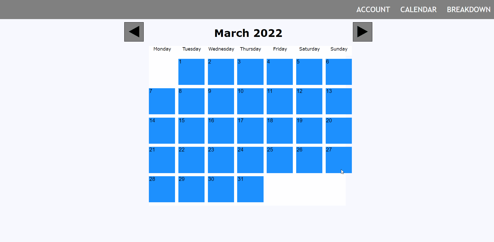

This website allows users to see the statistics from their app usage.
## Key Features
- Single Page Application that changes states for each section.
- Multiple accounts can be used to allow different people to store their data.
- Calendar for all of 2022.
- Store data for multiple apps per each day.
- Visual representation of the user's data.
## How To Use
1. Log in to an account
2. Change state on the top right, press **Calendar**.

3. Use the arrow buttons to select the desired month.
	- The current month and day will be displayed by default.
4. Select a day.
5. Enter the app name, duration used and the number of times the app was loaded.
6. Press **Save**. 
 
7. Change state on the top right, press **Breakdown**.
8. Press **Start Breakdown**.
9. The stats found from your data is displayed.

Press **End Breakdown** to end the breakdown.
You can enter more data into the calendar or swap users to continue using the program.

## Links
W3Schools.com for help with JavaScript.
- https://javascript.plainenglish.io/create-a-single-page-website-using-node-js-and-express-js-a0b53e396e4f
- https://www.w3schools.com/jsref/tryit.asp?filename=tryjsref_parseint
- https://www.w3schools.com/js/js_json.asp
- https://stackoverflow.com/questions/2881307/can-i-have-two-javascript-onclick-events-in-one-element
- https://stackoverflow.com/questions/34156282/how-do-i-save-json-to-local-text-file
- https://www.javascripttutorial.net/javascript-return-multiple-values/#:~:text=JavaScript%20doesn%27t%20support%20functions,array%2C%20or%20properties%20from%20objects.
- https://stackoverflow.com/questions/2917175/return-multiple-values-in-javascript
- https://www.w3schools.com/css/css_navbar_horizontal.asp
- https://www.oreilly.com/library/view/javascript-the-definitive/0596000480/re355.html

Written in HTML, JavaScript and CSS, using local storage.